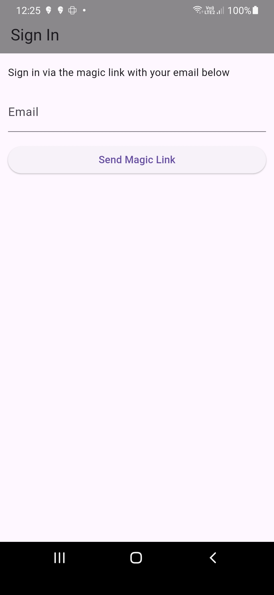
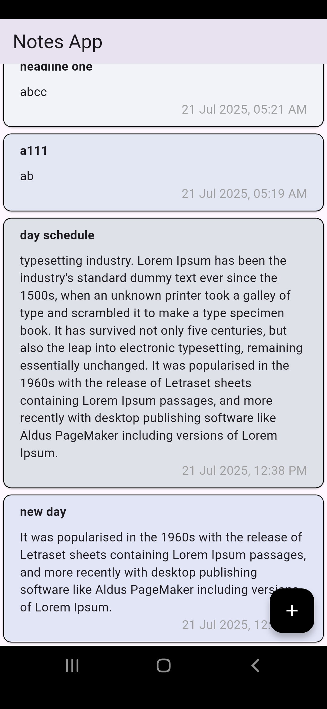
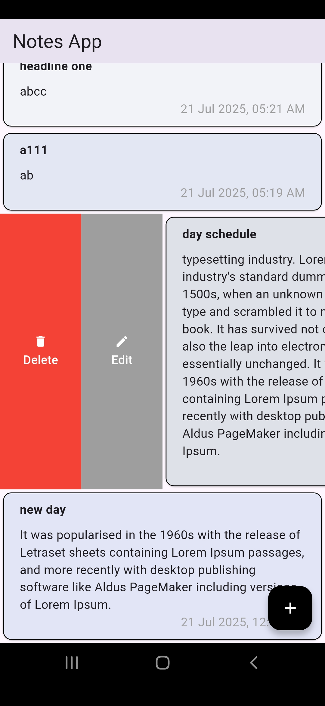

📒 Supabase Notes App – Flutter

A simple full-stack Flutter Notes App powered by Supabase. 
Users can sign up, log in, create, edit and delete their personal notes. 
All data is securely stored in a Postgres database with Row-Level Security.

---
📸 Screenshots

  
  
  
  
  

---
🚀 Features

    🔐 Email-based Authentication (Supabase Auth)
    📝 Create, Read, Update, Delete (CRUD) Notes
    📅 Notes sorted by creation time
    💾 Supabase Postgres for storage
    📡 Realtime Sync
    🧑 One user → only sees their own notes

🛠️ Tech Stack

    Flutter – Frontend
    Supabase – Backend-as-a-Service
        Auth
        Postgres Database
        Row Level Security
        Realtime (optional)
---

